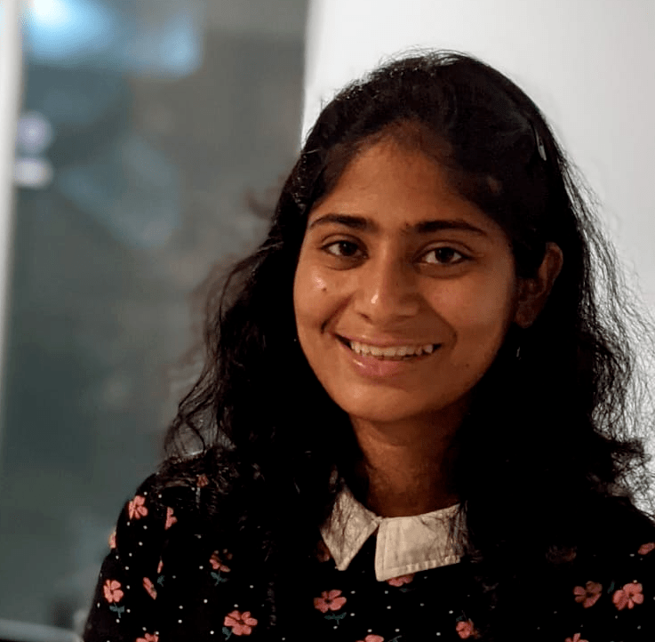

# Bangalore girl in the US!

## About Me

I'm Hema, a master's student at UC San Diego. I'm from Bangalore, which is also known as the "Silicon Valley" of India. I travelled to the United States for my masters and I'm enjoying the beatiful beaches of San Diego :smile: 

I live by the moto:  
> Live life without any regrets 

Read about my:
[Technical Interests](#technical-background-and-interests)  
[My Hobbies](#my-hobbies)  
[My Resume](#my-resume)  
[Social Media Links](#social-media)  
[Back to about me](#about-me)

## Technical Background and Interests

## My Hobbies
- Travelling: I enjoy travelling and getting to know the culture of different places. I like making detailed itineraries for my travels   
- Outreach: I organize and participate in community outreach activities. In particular, I'm passionate about promoting education among girls and have worked with different schools and organizations for the same. I'm the Grad Women-In-Computing K-12 outreach co-chair.  
- Dancing: Though not very much in touch, I occasionally practise dancing. I have learnt the Indian Dance form, Bharatanatyam and truly enjoy it  

## My Resume
[You can check out my resume here](Hema_Resume.pdf)

## Social Media
[LinkedIn](https://www.linkedin.com/in/hema-thota/)  
[GitHub](https://github.com/hemathota)  
[Instagram](https://www.instagram.com/wandering_hema/)  